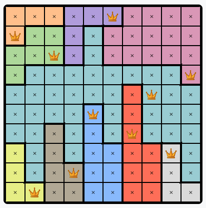
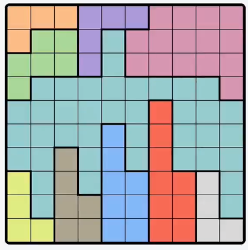
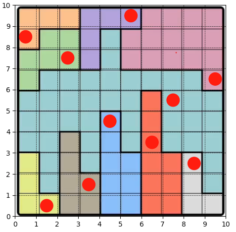

# Project Description

This is a fun project that solves the [queens game](https://www.linkedin.com/games/queens/) from linkedin using the Theorem Prover ```z3```. 

The game is a $n$ by $n$ grid, where $n$ could change. The goal is place queens over the grid such that:

1. Each color region has exactly one queen.
2. Each row has exactly one queen. 
3. Each column has exactly one queen.
4. No two queens can be neighbors. 

For example, this is the visualization of the solution of Queens 220:



# Requirements
To be able to run the code, ensure Python 3.7 or higher is installed on your system. You'll need to install the following:
```
pip install numpy, matplotlib, pillow, z3-solver
```
Then, run the main script in your preferred Python environment:
```
python main.py
```
# How It Works?

The code takes in as input an snapshot of the empty board. For our running example, it is the [figure](./queens_snapshots/queens_220.png) shown below. 



## Finding the colored regions
We create a 10 by 10 grid and overlay it on the input image. We find the RGB value of the center pixel of each cell using the python imaging library ```PIL``` (or ```pillow```). All cells that have close pixel values are set to be the same color. Here is how the color matrix looks like for the above image:

```
['c6', 'c6', 'c6', 'c1', 'c1', 'c1', 'c9', 'c9', 'c9', 'c9']
['c6', 'c2', 'c2', 'c1', 'c7', 'c9', 'c9', 'c9', 'c9', 'c9']
['c2', 'c2', 'c2', 'c1', 'c7', 'c9', 'c9', 'c9', 'c9', 'c9']
['c2', 'c7', 'c7', 'c7', 'c7', 'c7', 'c7', 'c7', 'c7', 'c9']
['c7', 'c7', 'c7', 'c7', 'c7', 'c7', 'c10', 'c7', 'c7', 'c7']
['c7', 'c7', 'c7', 'c7', 'c3', 'c7', 'c10', 'c7', 'c7', 'c7']
['c7', 'c7', 'c5', 'c7', 'c3', 'c7', 'c10', 'c7', 'c7', 'c7']
['c4', 'c7', 'c5', 'c7', 'c3', 'c3', 'c10', 'c10', 'c8', 'c7']
['c4', 'c7', 'c5', 'c5', 'c3', 'c3', 'c10', 'c10', 'c8', 'c7']
['c4', 'c4', 'c5', 'c5', 'c3', 'c3', 'c10', 'c10', 'c8', 'c8']
```

The actual color doesn't matter, all we care about is that the cells have the same color!

## Finding a SAT assignment
 
We define our Boolean variables as:

 ```
 grid = [[Bool("x_%s_%s"%(i,j)) for j in range(10)] for i in range(10)]
 ```

Then, we add all the constraints from the problem description as boolean constaints, and run the problem. Here is a visualization that the solver finds the correct solution:



We also add boolean constraints to find if there are additional solutions. Essentially every time the solver converges to a solution, we add a boolean constaint that the new boolean variable assignments cannot all match all the ones in a previous solution.  It turns out that this is the unique solution!
